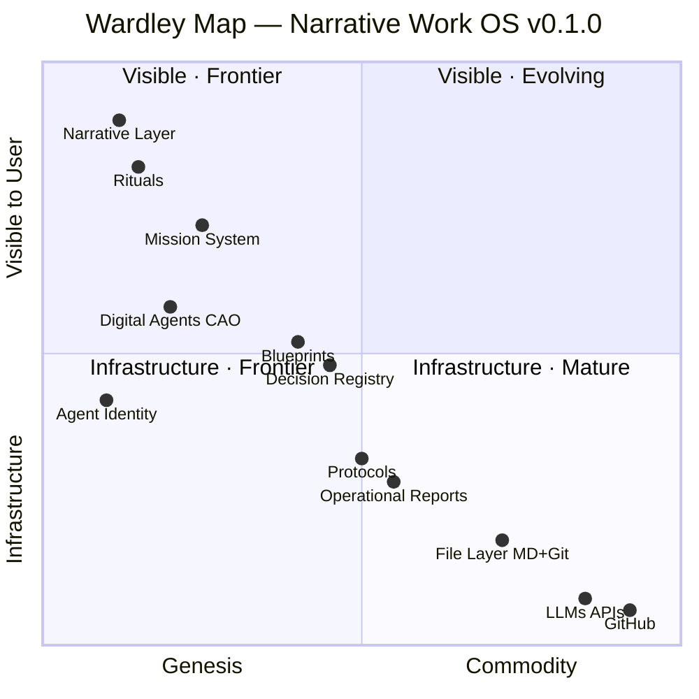

# Wardley Map — Narrative Work OS

> **Resumen:** Plano del sistema: estado actual, objetivo, gaps y dependencias.
> **Epistémico:** El estado real vs. el objetivo — dónde estamos y hacia dónde vamos.
> **Pragmático:** Identificar qué misiones abren los gaps documentados.
> **Audiencia:** Agentes · Oráculos

---


> A Wardley Map shows two things: **how visible** a component is to the user (Y axis) and **how evolved** it is in the market (X axis: Genesis → Custom → Product → Commodity).
> 
> Strategic insight comes from the gaps: components stuck in Genesis that should be Product, components heading to Commodity faster than the business realizes.

---

## Map (Mermaid)



---

## Components — Full Analysis

### 🎭 Frontier (Genesis) — High Visibility

| Component | Position | Strategic note |
|---|---|---|
| **Narrative Layer** | Genesis · Max visible | Highest differentiator. Highest adoption risk. External users may reject before seeing value. |
| **Rituals** | Genesis · Very visible | Daily, Dark Council, Lunar Coven. Unique engagement mechanism. Auto-selects cultural fit. |
| **Mission System** | Genesis→Custom · Visible | Core differentiator. Epistemic + pragmatic value per mission is nowhere else. Moat here. |

### 🤖 Frontier (Genesis) — Mid Visibility

| Component | Position | Strategic note |
|---|---|---|
| **Digital Agents (CAO)** | Genesis · Mid visible | Technology (LLMs) is commodity. Application layer (SOUL.md, OPERATOR.md, persistent identity) is custom. |
| **Agent Identity** | Genesis · Mid | khepri@, operational laws, persistent memory. No competitor has this today. |

### 🏗️ Custom — Mid Visibility

| Component | Position | Strategic note |
|---|---|---|
| **Blueprints** | Custom · Mid | Similar to C4 model or arc42, but with delta tables and semaphore. Converging to product. |
| **Decision Registry** | Custom · Mid | ADRs exist elsewhere. Narrative integration is custom. Append-only principle is differentiator. |

### 📄 Custom → Product — Low Visibility

| Component | Position | Strategic note |
|---|---|---|
| **Protocols** | Custom · Low-mid | SOPs + AI-readable format. Converging toward product. |
| **Operational Reports** | Custom · Low | Git-native, append-only. Simple but unique in format and agent-readability. |
| **File Layer (MD+Git)** | Product · Low | Commodity for devs. Custom for organizations. Crossing the chasm here is the adoption challenge. |

### ⚙️ Commodity — Infrastructure

| Component | Position | Strategic note |
|---|---|---|
| **LLMs APIs** | Commodity · Infrastructure | Anthropic, Ollama. Replaceable. No moat. Cost optimization target. |
| **GitHub** | Commodity · Infrastructure | Replaceable by any git host. No strategic dependency. |

---

## Dependency Chain

```
User/Organization
  └── Narrative Layer  ──────────── engagement hook
        └── Mission System  ──────── core value delivery
              ├── Decision Registry  ── organizational memory
              ├── Blueprints  ─────── system architecture
              └── Digital Agents  ─── execution layer
                    ├── Agent Identity  ── trust & continuity
                    ├── LLMs APIs  ────── [commodity]
                    └── File Layer  ───── persistent state
                          └── GitHub  ── [commodity]

Protocols ──────────────────────────── cross-cutting
Operational Reports ─────────────────── cross-cutting
Rituals ─────────────────────────────── cross-cutting (human layer)
```

---

## Strategic Tensions

### Tension 1: Genesis visibility vs. adoption barrier
The Narrative Layer is the most visible AND the most Genesis. Users hit it first and may reject before reaching the Mission System (the real value). **Mitigation:** /nwos page leads with substance, narrative as optional L4.

### Tension 2: LLM commoditization speed
In 12-18 months, Notion/Confluence/Microsoft will have native agents. The moat is NOT the LLM integration. **The moat is the Mission System + Decision Registry + Blueprints as a coherent operating system.** File-over-App is the lock-in that works *for* the user, not against them.

### Tension 3: File Layer adoption gap
MD+Git is Product for developers, Genesis for non-technical organizations. The ICP (startup técnica 5-15p) crosses this gap naturally. The traditional PYME (50-150p) does not. **This is why simulations show 10% success for PYME vs 55% for tech startups.**

### Tension 4: Rituals in Genesis = fragility
Rituals (Daily, Dark Council, Lunar Coven) are in Genesis and highly visible. They generate the highest cultural engagement but also the highest churn risk if the team doesn't adopt the vocabulary. **Mitigation:** make rituals optional, value-proof first.

---

## Evolution Predictions (12-18 months)

| Component | Current | Predicted | Risk |
|---|---|---|---|
| Digital Agents | Genesis | Custom | Competitors will offer similar |
| LLMs APIs | Commodity | More commodity | Cost drops, not a moat |
| Mission System | Custom | Product | **Window to establish standard** |
| File Layer | Product | Commodity (for devs) | Accelerate adoption before it's assumed |
| Narrative Layer | Genesis | Genesis/Custom | Will remain differentiated if adoption works |

---

## The Strategic Bet

> The NWOS is betting that **File-over-App + Agent-native design + Mission System as knowledge artifact** will become the standard for AI-integrated organizations before large players (Notion AI, Confluence AI, Microsoft Copilot) commoditize individual components.
>
> The window is approximately **18-24 months**.

---

*Nimrod 🗡️ — Wardley Map v0.1.0 — 2026-04-07*
